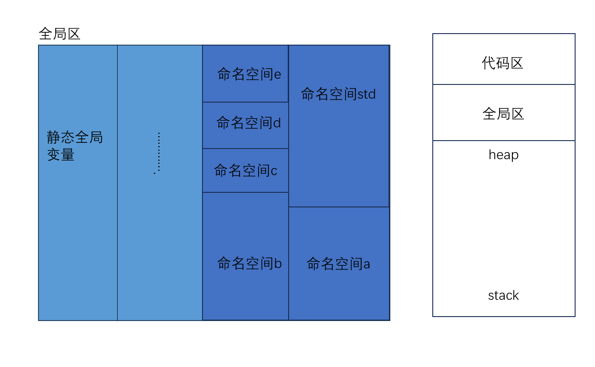
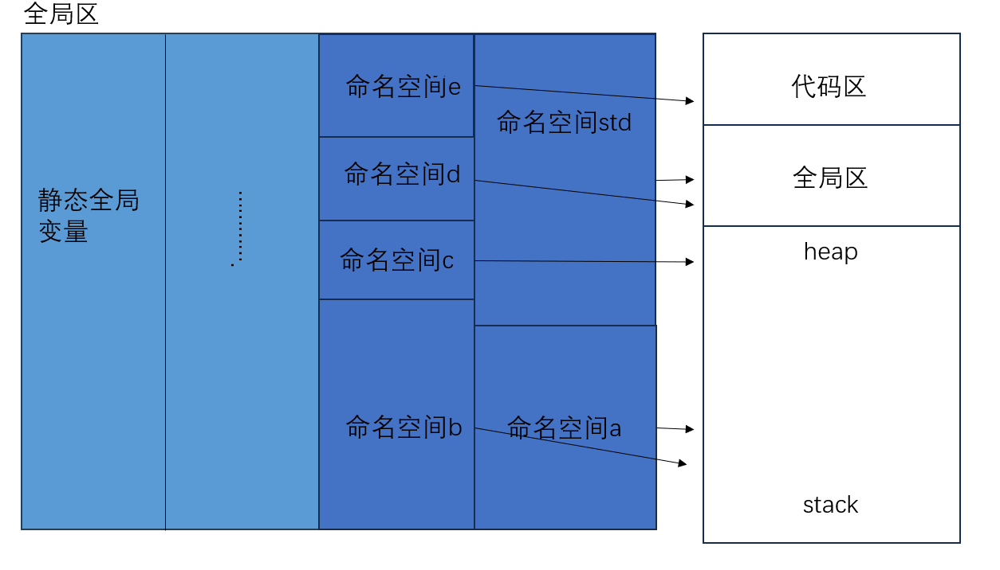

## 命名空间
作为一个学完c转c++的新手，看到c++的命名空间的实现时，自然而然觉得它是对全局区的管理，经过资料查找，我总结了以下几点关于namespace的理解:
1. 划分全局区作用区:将全局变量，函数，类封装到不同的命名空间里，防止名称冲突
2. 模块化管理:不同的库和模块，可以使用不同的命名空间，避免符号污染全局作业域
3. 增加可读性:通过命名空间可以某个函数或者某个类属于哪个模块.

**你可能不知道上面在说什么意思,看后面就慢慢明白了**

---
#### 我们先看使用方法,对于怎么访问有以下几种方式:
1. 直接访问，就是比如std::cout，安全系数很高，直接加前缀。
2. using std::cout，避免重复使用，后面代码可以直接写cout。
3. using namespace std,使用整个命名空间。

后面俩种方式如果在函数中使用，前者相当于将函数的cout全部替换成std::cout，他们是完全等价一样的，后者相当于告诉函数你可以访问std**全局**空间的成员，就好比std命名空间里有个全局的std::age变量，但你可以在函数中再定义一个局部的age变量。

#### 命名空间的特定:
1. 可以嵌套，如上面所说的，你可以把全局变量想象成一块区域(正方形或者任意)，命名空间各自占用一部分区域，你在命名空间内又可以划分区域进行命名。这是我的一种抽象理解
2. 命名空间可以匿名，相当于静态全局变量，通过比如::cout(不用加名字)进行访问，感觉又有但不多。

#### 使用命名空间时需要谨慎: 
上述我们提到，使用using namespace std在我们代码文件的顶部与头文件一起,就是让我们接下来的代码全部使用这个std(不知道我解释清楚没有)，在笔记的最后，我会画个图来举例。如果我的项目足够大，那么我的std就很容易污染整个全局区，导致我其他有着与std命名空间相同的变量名、函数已经类无法使用。
可以缓解这个问题的方法是，我们只在函数里用using namespace xx(这里要说明的是，函数内是无法定义命名空间的，毕竟那是栈空间)。
如果学过python的模块知识，其实也会发现俩者之间有异曲同工之妙，但底层实现和使用还是有些区别的

思考图片:
1. 命名空间在全局区的抽象化(会体现它的优点)

    * 我们可以注意到命名空间相当于在全局区申请了一块土地,不同土地之间是相互隔离的.打个比方:他们每个地盘都有叫张三的成员,但这些张三是不同的.我需要指定哪个命名空间,然后再找我要的张三.
2. 命名空间在全局区的建立
   ```C++
    #include <iostream>
    namespace xx
    {
        成员(函数,变量名,结构体,子命名空间...)
    }
    int main()      
   ```
   * 我们可以清楚的看到命名空间是在全局区定义的,其实你可以想象上面那块区域多了给命名空间
3. 命名空间的成员的调用(抽象化)
   |方式|效果|
   |:-:|:-:|
   |using namespace std|非常不安全|
   |using std::cout|较安全|
   |std::cout|非常安全|

   
   **这已经非常形象了**
4. 命名空间使用不当，会造成的现象
   与前面说的一样,当如果使用using namespace std时,你如果放这全局区,那显然命名空间std就直接污染了整个全局区.所以在合作开发的过程中,我们最好一步步调用命名空间的成员.